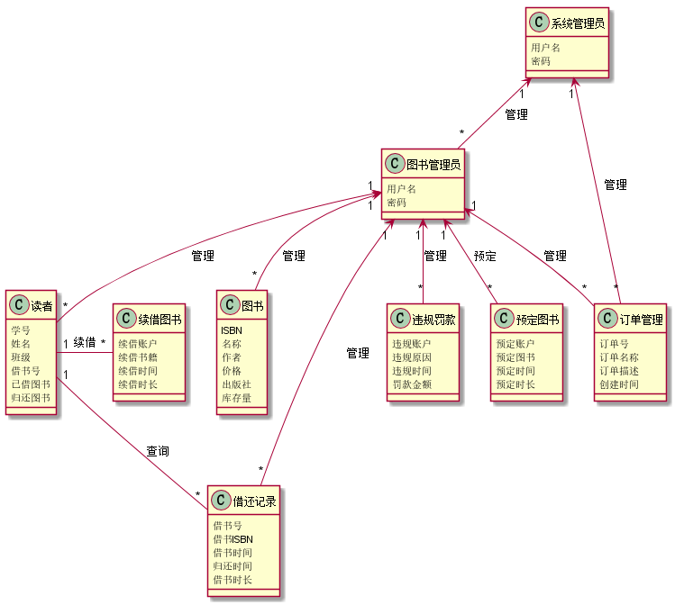
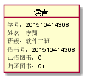
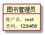
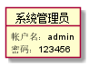
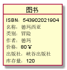
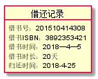
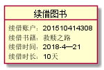
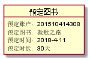
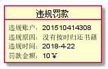
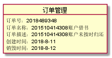

实验三：图书管理系统领域对象建模
================
|学号|班级|姓名|照片|
|:-:|:-:|:-:|:-:|
|201510414308|软工3班|李翔|无|

1.图书管理系统的类图
--------------
### 1.1 plantuml源码如下:
<pre>
@startuml
class 图书管理员{
用户名
密码
}
class 读者{
学号
姓名
班级
借书号
已借图书
归还图书
}
class 系统管理员{
用户名
密码
}
class 图书{
ISBN
名称
作者
价格
出版社
库存量
}
class 借还记录{
借书号
借书ISBN
借书时间
归还时间
借书时长
}
class 违规罚款{
违规账户
违规原因
违规时间
罚款金额
}
class 续借图书{
续借账户
续借书籍
续借时间
续借时长
}
class 预定图书{
预定账户
预定图书
预定时间
预定时长
}
class 订单管理{
订单号
订单名称
订单描述
创建时间
}

系统管理员"1"<-- "*"图书管理员:管理
图书管理员"1"<--"*"读者:管理
图书管理员"1"<--"*"图书:管理
图书管理员"1"<--"*"订单管理:管理
图书管理员"1"<--"*"预定图书:预定
图书管理员"1"<--"*"违规罚款:管理
图书管理员"1"<--"*"借还记录:管理
系统管理员"1"<--"*"订单管理:管理

读者"1"--"*"借还记录:查询
读者"1"-"*"续借图书:续借

@enduml
</pre>

### 1.2 类图如下:

### 1.3 类图说明:
<pre>
此类图包含三个角色类：读者、图书管理员、系统管理员。
一个实物类：图书。
五个事务类：借还记录、续借图书、预定图书、违规罚款、订单管理。
</pre>

2.图书管理系统的对象图
-------
### 2.1 读者类
### 源码
<pre>
@startuml
object 读者{
学号：201510414308
姓名：李翔
班级：软件三班
借书号：201510414308
已借图书：C
归还图书：C++
}
@enduml
</pre>

### 对象图

### 2.2 图书管理员类
### 源码
<pre>
@startuml
object 图书管理员{
帐户名：root
密码：123456
}
@enduml
</pre>

### 对象图

### 2.3 系统管理员类
### 源码
<pre>
@startuml
object 系统管理员{
帐户名：admin
密码：123456
}
@enduml
</pre>

### 对象图

### 2.4 图书类
### 源码
<pre>
@startuml
object 图书{
ISBN：543902021904
名称：德玛西亚
类别：冒险
作者：德玛
价格：80￥
出版社：峡谷出版社
库存量：120
}
@enduml
</pre>

### 对象图

### 2.5 借还记录类
### 源码
<pre>
@startuml
object 借还记录{
借书号：201510414308
借书ISBN：3892353421
借书时间：2018—4—1
借书时长：20天
归还时间：2018-4-21
}
@enduml
</pre>

### 对象图

### 2.6 续借图书类
### 源码
<pre>
@startuml
object 续借图书{
续借账户：201510414308
续借书籍：救赎之路
续借时间：2018-4—21
续借时长：10天
}
@enduml
</pre>

### 对象图

### 2.7 预定图书类
### 源码
<pre>
@startuml
object 预定图书{
预定账户：201510414308
预定图书：救赎之路
预定时间：2018-4-11
预定时长：30天
}
@enduml
</pre>

### 对象图

### 2.8 违规罚款类
### 源码
<pre>
@startuml
object 违规罚款{
违规账户：201510414308
违规原因：没有按时归还书籍
违规时间：2018-4-22
罚款金额：10￥
}
@enduml
</pre>

### 对象图

### 2.9 订单管理类
### 源码
<pre>
@startuml
object 订单管理{
订单号：2018489348
订单名称：201510414308账户借书
订单描述：201510414308账户未按时归还
创建时间：2018-8-11
销毁时间：2018-8-12
}
@enduml
</pre>

### 对象图

