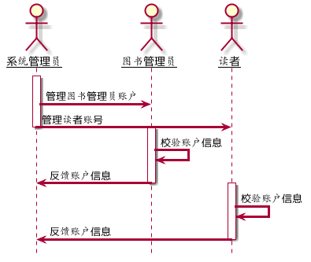
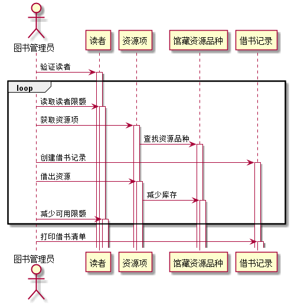

# 实验4：图书管理系统顺序图绘制
<table>
<tr>
<td>学号</td>
<td>班级</td>
<td>姓名</td>
</tr>
<tr>
<td>201510414308</td>
<td>2015级软件工程三班</td>
<td>李翔</td>
</tr>
</table>

## 1 管理用例
### 1.1 用例PlantUML源码：
    @startuml
    skinparam sequenceArrowThickness 3
    skinparam roundcorner 30
    skinparam maxmessagesize 80
    skinparam sequenceParticipant underline
    hide footbox

    actor 系统管理员 as root
    actor 图书管理员 as admin
    actor 读者 as user

    activate root
    root -> admin:管理图书管理员账户
    root -> user:管理读者账号
    deactivate root

    activate admin
    admin -> admin:校验账户信息
    admin -> root:反馈账户信息
    deactivate admin

    activate user
    user -> user:校验账户信息
    user -> root:反馈账户信息
    deactivate user
    @enduml

### 1.2 管理用例顺序图：

### 1.3 管理用例顺序图说明：
顺序图过程展现了系统管理员对图书管理员和读者的管理和维护，同时图书管理员和读者都可以反馈信息给系统管理员

## 2 借书用例
### 2.1 用例PlantUML源码：
    @startuml
    actor 图书管理员
    participant 读者
    participant 资源项
    participant 馆藏资源品种
    participant 借书记录

    图书管理员 -> 读者:验证读者
    activate 读者
    loop
    图书管理员 -> 读者:读取读者限额
    activate 读者
    图书管理员 -> 资源项:获取资源项
    activate 资源项
    资源项 -> 馆藏资源品种:查找资源品种
    activate 馆藏资源品种
    图书管理员 ->借书记录:创建借书记录
    activate 借书记录
    图书管理员 ->资源项:借出资源
    activate 资源项
    资源项 ->馆藏资源品种:减少库存
    activate 馆藏资源品种
    图书管理员 ->读者:减少可用限额
    activate 读者
    end
    图书管理员->借书记录:打印借书清单
    activate 借书记录
    @enduml

### 2.2 用例顺序图：

### 2.3 用例顺序图说明：
本用例由图书管理员操作，需要对读者的信息进行验证，才能执行图书借阅记录的创建等操作，并同时对图书表中的库存数进行更新，逾期记录表由系统进行创建，无需操作
