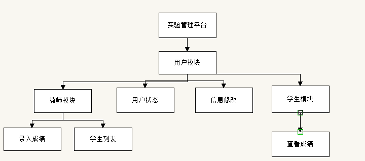
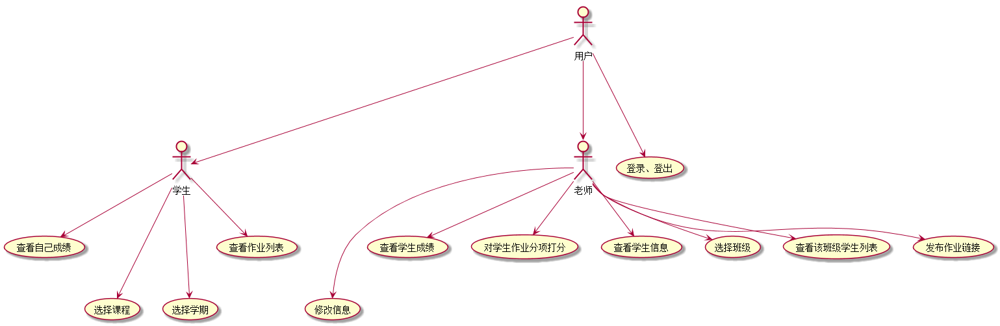
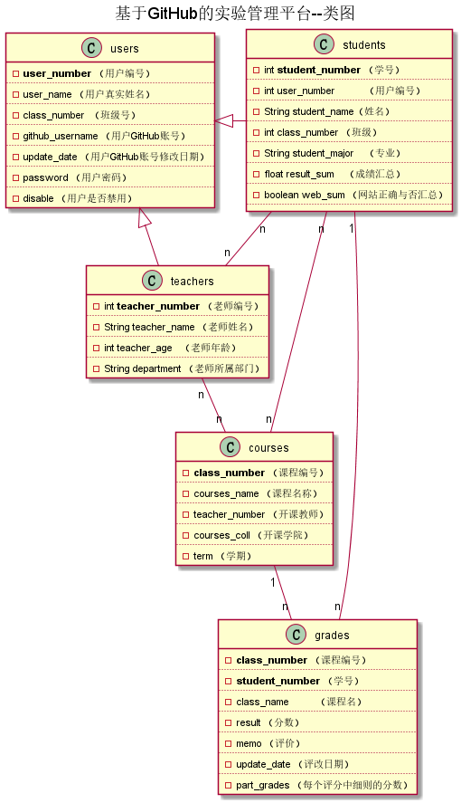

# 基于GitHub的实验管理平台的分析与设计

### 成都大学信息科学与工程学院

|学号|班级|姓名|照片|
|:-------:|:-------------: | :----------:|:---:|
|201510414308|软件(本)15-3|李翔|

## 1. 概述
- 基于GitHub的实验管理平台的作用是在线管理实验成绩的Web应用系统。教师的作业示例以及学生所做的作业都放在这里。
- 学生能够自己创建用户，自己设置用户信息，学生的用户信息是公开的，可以通过这个查看其余用户所上传的内容，然而成绩不公开。
- 教师可以查看检查学生的作业，在这里批改学生的作业，并写评语，给学生打分，并记录批改时间。
- 教师和学生都能通过本系统的链接方便地跳转到学生的每个GitHUB实验目录，以便批改实验或者查看实验情况。
- 实验成绩最高一百分，最低零分，系统会自动计算改同学的平均分，教师可以只负责批改并未每次批改打分。
- 该基于Github的实验管理平台的主要作用是方便学生提交和老师批改作业，实现了去中心化。
- 老师可以在该平台查看每一个学生每一学期的每门课程,每一个实验的情况，并根据每一个部分的完成度打分，
- 学生之间也可以互相查看实验，但不能互相看到分数。
- 每个教师可以开设多门课程，每个学生也客户以选择多门课程，当然，每个教师只能修改并维护自己所上科目的课程成绩，每个学生也只能查询自己的课程成绩，并且不能做出修改。
- 教师先选择要开设的课程之后，学生才能选课。
- 每个实验的实验成绩细分为多个评分项，每个评分项对应各自的评分标准。
## 2. 系统总体结构

## 3. 用例图设计 [源码](Usecase.puml)

## 4. 类图设计 [源码](class.puml)

   ## 5. 数据库设计
   ###[参见数据库设计](database.md)  

## 6. 用例及界面详细设计
  ### [登录用例](用例_登录.md)
  ### [用户信息管理用例](用例_用户信息管理.md)
  ### [学生用例](用例_学生列表.md) 
  ### [查看用例](用例_查看成绩.md)
  ### [选课用例](用例_选课.md)
  ### [用例_教师选课](教师选课.md)
  ### [评定成绩用例](用例_评定成绩.md)

